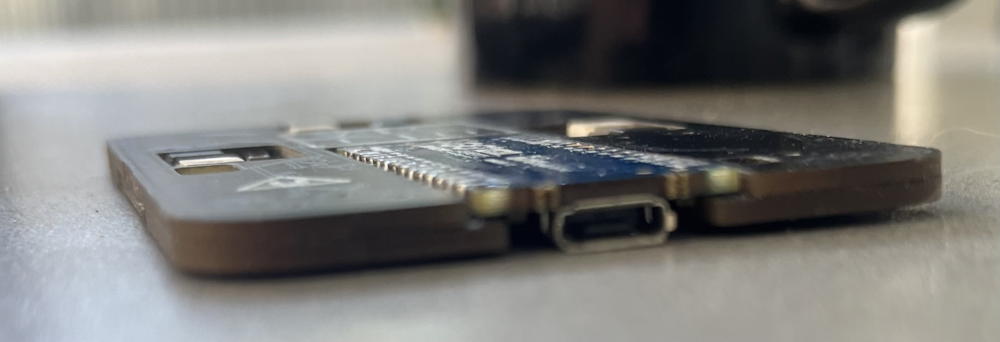
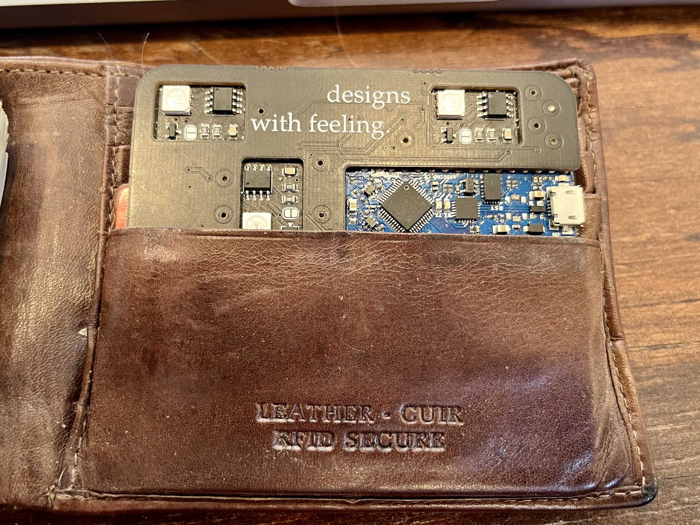
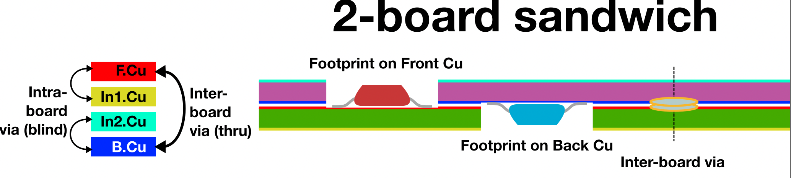
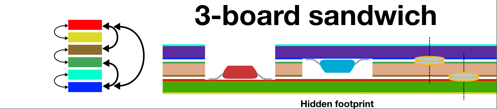
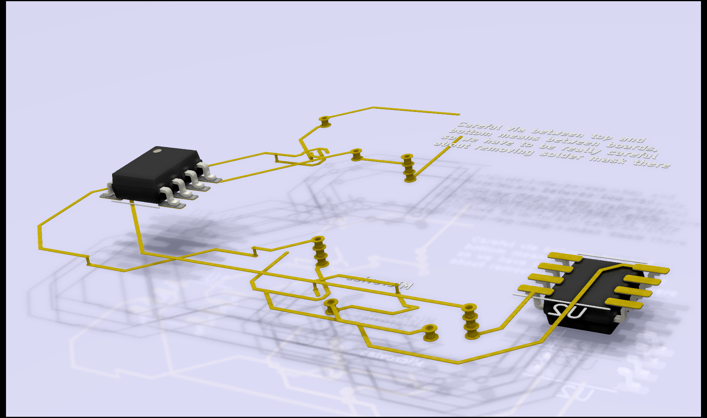
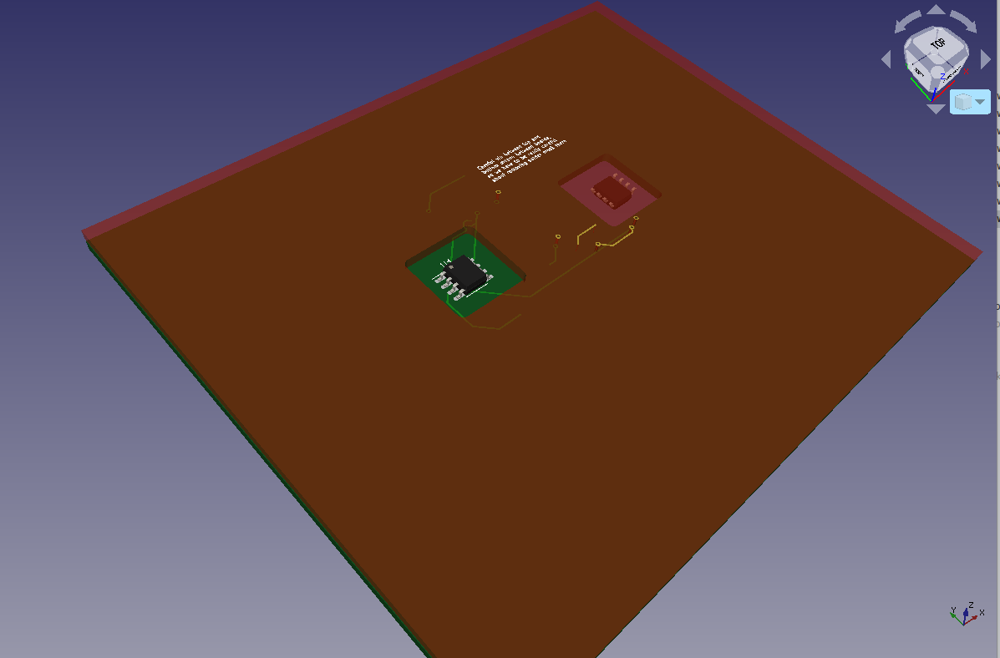
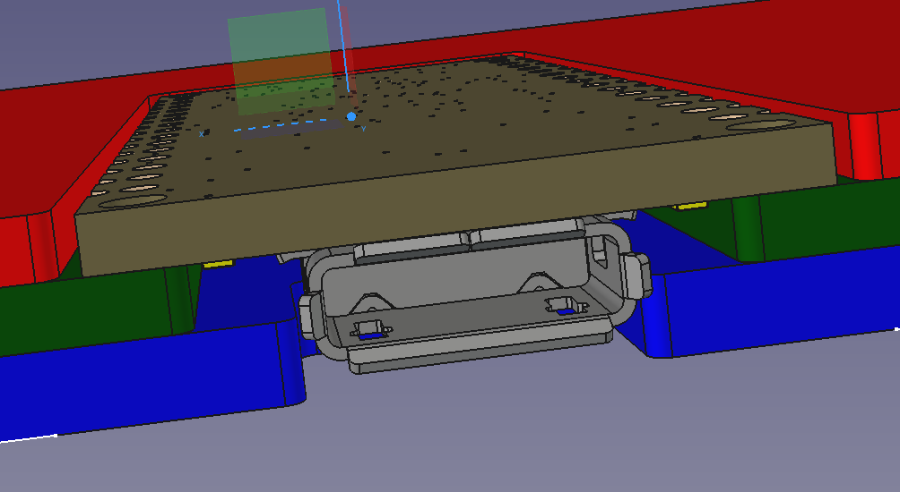
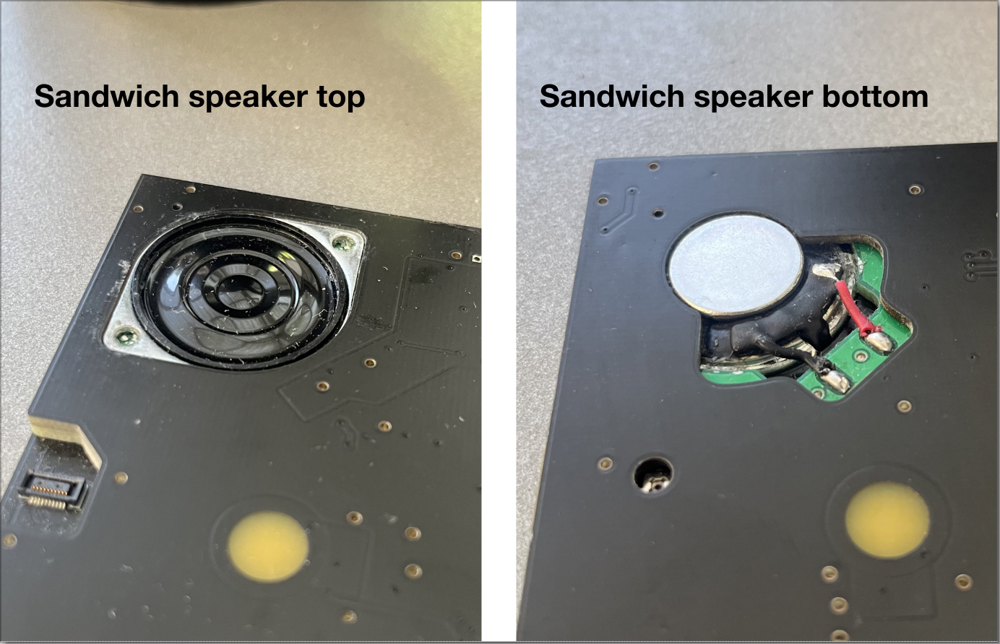
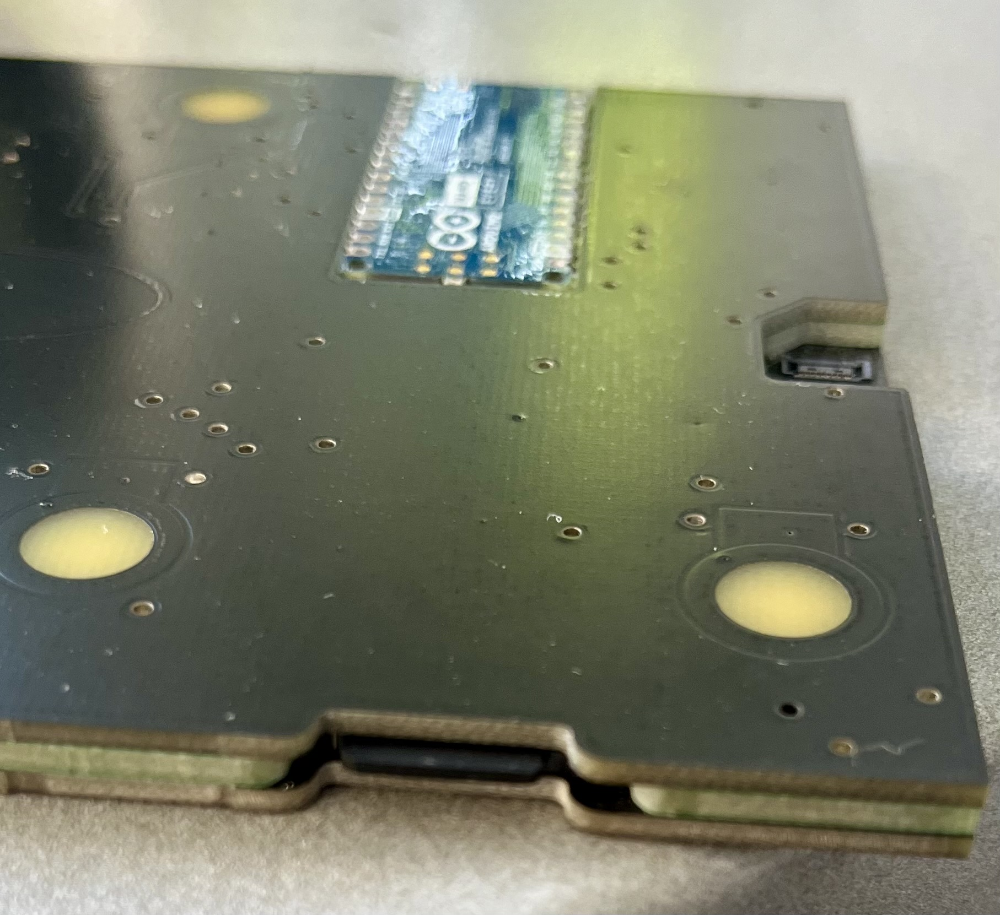
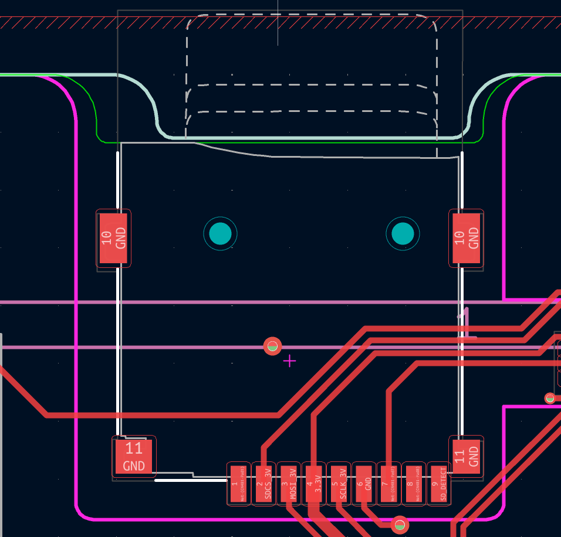

# KiSandwich
# KiSandwich

A KiCad plugin for designing **sandwich PCBs** — multiple boards bonded
together face-to-face into one device. Doing this lets you hide components
completely inside the stack, get 4-layer routing out of a pair of 2-layer
boards, and build truly zero-profile hardware (business cards, wallet-thin
gadgets, embedded speakers and microSD slots).

This construction technique is new and rarely used, so no design tools exist
for it — professional or otherwise. KiSandwich is an attempt to fill that gap:
you design one combined board in KiCad, and the plugin splits it into the
individual 2-layer boards you actually fabricate and bond.




## Concept




## Why would you do this

1. **Zero-profile design.** Build truly flat hardware — slip it in a wallet, embed it in a case, or hide it completely.
2. **Hide your components.** Recess and even hide parts into the board for things like backlit capacitive buttons.
3. **Get more routing layers.** Effectively get 4-layer routing out of a pair of 2-layer boards (or 6-layer out of three).
4. **Populate both sides cheaply.** Put components on both faces even if your pick-and-place only does one side.

This builds on [Oreo construction](https://hackaday.com/2019/01/18/oreo-construction-hiding-your-components-inside-the-pcb/),
which has more reasoning and a build example.
## Installation
### Install kigadgets
This is a wrapper for KiCAD's python SWIG. It is needed for version-independent action plugins. Follow instructions at [kigadgets](https://github.com/atait/kicad-python).

### Install kicad-sandwich action plugin
Clone this repository. Symlink the whole thing (`kicad-sandwiches`) into your kicad user plugins directory. This directory is located in ${KICAD_USER_DIR}/scripting/plugins, where ${KICAD_USER_DIR} depends on your operating system. You can find out where it is using the menu item "Tools > External Plugins > Reveal Plugin Folder". On macOS, you can avoid the terminal by right clicking the repo, making an "alias", and moving that alias to the plugins directory.

The next time you start pcbnew, you should see these icons in the menu bar.


If not, try going to Preferences>"action plugins" to search for them in the list and check the enable boxes.

## Examples
### Example files
The "examples" directory walks through a full design flow. The main design file is called "sandwich-example.kicad_pcb". It is designed as a 4-layer board with surface mount components on front and back. The image "pcbnew-snapshot.png" shows what the program *thinks* you are designing.



and here is what you are actually designing. Bottom board is green. Top board is red and transparent, and both ICs are recessed:



### Example footprints (tested and fabricated)
KiCAD footprints are found in kicad-sandwiches.pretty. Put them in a project library or a global library, and add that to your footprint paths to use them.

#### 2-board Arduino Nano
It is not quite zero profile because of the USBmicro but very close.


#### 3-board Arduino Nano
This is a 3-board sandwich with the Arduino Nano in the middle. It is completely hidden and zero profile. There is a hole so the reset button can be accessed.



#### Sandwich speaker
A zero-profile high-quality magnetic speaker (not a buzzer). It is almost exactly 5.2mm thick, so it fits with a 2mm midboard and 1.6mm outer boards. There is no room for screws, so it is glued in. Wire contacts are soldered to the midboard, so they are zero-profile too.

Tested with Digikey part: CLS0281MAE-L152



#### Hidden microSD card slot
A microSD card slot that is completely hidden and zero profile. It is accessed from the side of the sandwich.




## Designing
#### Actual layer meanings
The real thing will be stacked in the opposite order. F.Cu and B.Cu are used to represent the layers on the inside of the sandwich, while In1.Cu and In2.Cu represent what will become the outside of the sandwich. F and B will bond to one another with solder.

The reason for doing this is that blind vias make sense (except blind vias between In1 and In2). Components can be placed on F and B, but not In1 and In2. Most of the same DRC still applies, for example, a trace on F.Cu can pass over a buried via between B and In2.

**User.Eco1** makes cuts in the TOP board. Make sure cuts defined by Eco1 do not intersect footprints on Back. If it is a 2-board internal stack, put Eco1 openings around footprints on Front.

**User.Eco2** makes cuts in the LOW board. Make sure cuts defined by Eco2 do not intersect footprints on Front. If it is a 2-board internal stack, put Eco2 openings around footprints on Back.

**Margin *or* User.3** make cuts in the MID board if there is a 3-board stackup (i.e. 6 copper layers). In a 3-board stack, make sure there are slots in this layer for all footprints on front or back.

#### Running the scripts
Using the kisandwich plugin, this "board" is converted to two other files corresponding to the actual 2-layer boards: "kisandwich-out/sandwich-example-sandwich_\[LOW|TOP\].kicad_pcb". The plugin is activated with the  button, which gives a dialog with various options.

There are also entry points available to external python environments. These work on board files instead of the GUI's board.

#### Bonding pads
If you want a standard through via on one of your resulting boards, make this a *buried* via in the base design. A buried via between F.Cu/In1.Cu will get converted to a regular via on the LOW board. Buried vias between In1.Cu and In2.Cu make no sense! Those correspond to layers on the outside of the stackup.

kisandwich will interpret through vias as bonding points. It will tent them (covered by solder mask) on the outer sides, and de-tent them on the insides so that a big copper pad is exposed. When you get the PCBs, you put solder paste on these pads and reflow. Having a hole is extremely useful so you can stick in a soldering iron in case your reflow doesn't yield 100%.

Recommended bond pad parameters: Via diameter = 2 mm; Via hole = 1 mm

#### FreeCAD integration
In the same directory, all the boards are exported to VRML (.wrl) models.

**Todo: is this automated yet? KiCad 7 changed some VRML entry points**

**Todo: describe FreeCAD plugin installation here**

The models are assembled together in FreeCAD in the file "FreeCAD-out/stack-3dModel.FCStd". In FreeCAD, the lower board is translated down by one board thickness, and their appearances can be altered. Finally, a snapshot of the FreeCAD assembly is included in "FreeCAD-out/assembled-snapshot.png".

#### DRC
Both the source combined design and kisandwich outputs should roughly make sense as PCBs. The whole process of kisandwiches is designed to make both perspectives sensible.
The outputs must be valid 2-layer PCBs. The combined design should be a valid 6-layer or 4-layer PCB design, just with some new features and some other features verboten. This means DRC is a valid and highly useful tool.

The overall design should pass DRC, except for board outline violations. This will catch things like wires too close, and it won't hit non-errors like F.Cu crossing a B.Cu/In2.Cu buried via. It might have strange hits on edge aspects, which is what the individual-output board DRC is for.

All of the kisandwich-out boards should also pass DRC: clean. This will catch things like inclusion of tracks within edge cuts. KiCad's routing assistant does not know which Eco layers to avoid. That means (for a 3-board stackup) there are 4 DRCs to do: one for the combined design, and one for each of the three boards. They are meant to help you, so suck it up, iterate, and hunt down those errors.


#### Ctrl-Z
It finally works now. This was revolutionary. You can preview TOP, Ctrl-Z, preview LOW, Ctrl-Z without modifying anything or creating temporary files. It is recommended that you close and reopen the file after previewing the sandwiches *without saving*, just in case. As far as I know, Ctrl-Z works 100%, but just in case.

## Advanced features for 3-board stackups
See `kisandwich/three_board.py` for full information about modified layer mappings.

### 6-layer routing
As before, In1.Cu will map to B.Cu of the LOW board. Similarly, the lowest internal routing layer will map to F.Cu of the TOP board; however, that lowest layer is now In4.Cu instead of In2.Cu. Now, In2.Cu and In3.Cu will map to the MID board's F.Cu and B.Cu.

The vias get more complicated now. As before, a little buried via between F.Cu/In1.Cu will result in a normal through via on LOW. Likewise, buried B.Cu/In4.Cu -> through on TOP, and buried In2.Cu/In3.Cu -> through on MID.

A through via will get turned into through vias on all boards for bonding - make sure they use the recommended parameters above. kisandwich will take care of tenting.

What about buried vias In1.Cu/In2.Cu and In3.Cu/In4.Cu? These also get turned into bond pads. Make sure they use recommended diameter/drill parameters. The difference is that these bond pads are still buried, going only between LOW/MID or only between MID/HIGH.

### Footprints defining cuts
Any footprint whose *Value* field starts with "KISANDWICH-CUTTER" will have its graphic objects on Eco1, Eco2, Margin, User.3 interpreted as cuts, just as if they were drawn in the PCB file itself. This is very useful if you have some mechanical component stuck in the boards and need to move it around while keeping all cuts aligned. For example, a zero-profile screw point or an embedded speaker.

### Footprints on MID
Any footprint whose *Value* field starts with "KISANDWICH-MIDBOARD" will end up on the MID and removed from TOP and LOW. Front stays as Front, and Back as Back. I'm not sure when you would want to do this with an IC; maybe it is a sensor of some kind. Where this gets more useful is with modules with vector art that you want to expose through one of the Eco cuts.

### Drawing on MID
This requires a text editor. Open your .kicad_pcb file and add layers starting with "Mid." as shown below. The layer numbers don't matter because kigadgets will find them by name. Note, the exact format of this file might depend on version of kicad

```
(layers
  (0 "F.Cu" signal)
  (1 "In1.Cu" signal)
  ...
  (49 "F.Fab" user)
  (60 "Mid.F.SilkS" user)
  (61 "Mid.B.SilkS" user)
  (62 "Mid.F.Mask" user)
  (63 "Mid.B.Mask" user)
)
```

### Stencil creation
This does not work great for 2-board because both have components placed. With 3 boards, you want to use a stencil on both sides of MID, which likely does not have pre-placed physical components. There is a stencil option in the popup window, which is probably self explanatory for the most part. Even if you don't make a physical stencil, the stencil layout will point out places that bonds will go.


## Construction methodology
I have so far made 4x 2-board designs, and about 5x 3-board designs. I have mass produced about 150x copies of these designs in batches. Full documentation of that process with pictures is on the way... A quick summary will have to do for now.

### What you need
- Crocodile clamps. These apply a lot more force than alligator clamps
- Solder paste. Preferably a low-temperature eutetic alloy
- Remote oven thermometer. It is best to use its air probe, but I think a meat probe is fine
- Timer
- Cooling rack, or anything to which you can attach the probe
- Parchment paper
- Soldering iron with a fine (<1 mm), conical tip
- Continuity tester like the one on most multimeters

### Procedure for attaching 2 boards
No stencil here. Take your solder paste in a syringe, and put dabs directly on bond pads, one-by-one. Gently mate LOW with TOP, then use croc clamps to squeeze. The rest of the steps are same as below

### Procedure for attaching 3 boards w/ stencil
- Using the TOP stencil, apply paste to the MID board
- Gently put the MID board on top of the TOP board
- Using the LOW stencil, apply paste to the other side MID board, now facing up
- Gently put the LOW board on that fresh layer of paste
- Squeeze together using crocodile clamps, and make sure the alignment is good

### Procedure for reflow bonding
- Preheat your oven to ~400 F
- Get the little card that came with your solder paste that has optimal reflow profile. Put it next to your oven
- Arrange your boards with croc clamps on parchment paper on the cooling rack
- Attach the thermometer probe so that it is close to the PCBs but not touching anything solid
- Slide out an oven rack, and put the cooling rack (or whatever thing) on the oven rack
- Do not return the oven rack. Let it warm up a bit. 60 seconds tends to work.
- Slide in the oven rack. While watching temperature, let it get to the starting temp specified on the card
- While closely watching timer and comparing to the card, *partially* close and open the oven door to follow the profile
- For the "hit it" period, fully close the oven. Let it get *slightly* hotter for *slightly* longer than specified
- Fully open the oven. As it cools, slowly slide out the oven rack until you reach the card's end temperature
- Take the whole thing out and let it cool

### Procedure for rework
Yield is pretty good but less than 100%. You can use a continuity meter on the outside of the stackup to see what didn't connect. This does not work on buried bond pads, so you also have to rely on functional testing. LED not lighting up? It probably has something to do with the bond pad to that LED.

Jam the soldering iron with sharp conical tip into the hole of the disconnected bond pads. This will not damage good bonds, so you could just do this on every bond. If there was not enough solder paste, you sometimes have to cut off a few millimeters of solder wire, stick that in the hole, then bring in the soldering iron.
