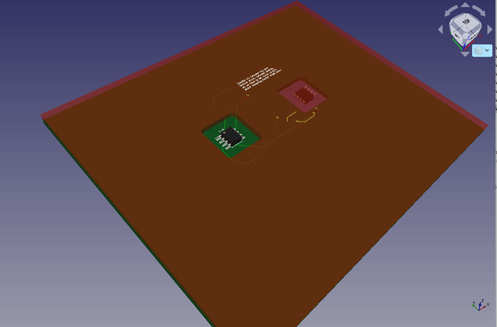

# KiSandwich
Plugin for designing multi-PCB systems where PCBs are bonded together. This is a useful construction technique for extending form factor, component density, and cost of circuit projects. Since they are relatively new, there is a complete lack of design tools, professional or otherwise, for these methods.

## Why would you do this
1. Effectively get 4-layer routing out of a pair of (cheaper) 2-layer boards
2. Put components on both sides, even if the pick-and-place only supports single side
3. Tuck components away to create a flat surface on both sides. Put it in a wallet or something. With a third board on top, one could even hide components completely.

For further reasoning and a build example, see https://hackaday.com/2019/01/18/oreo-construction-hiding-your-components-inside-the-pcb/

## Installation
Clone this repository into your kicad user plugins directory. This directory is located in ${KICAD_USER_DIR}/scripting/plugins, where ${KICAD_USER_DIR} depends on your operating system. Find out where it is with [this article](https://forum.kicad.info/t/library-management-in-kicad-version-5/14636).

The next time you start pcbnew, you should see these icons in the menu bar.

 

If not, try going to Preferences>"action plugins" to search for them in the list and check the enable boxes.

## Usage example
The "examples" directory walks through a full design flow. The main design file is called "sandwich-example.kicad_pcb". It is designed as a 4-layer board with surface mount components on front and back. The image "pcbnew-snapshot.png" shows what the program *thinks* you are designing.

#### Actual layer meanings
The real thing will be stacked in the opposite order. F.Cu and B.Cu are used to represent the layers on the inside of the sandwich, while In1.Cu and In2.Cu represent what will become the outside of the sandwich. F and B will bond to one another with solder. 

The reason for doing this is that blind vias make sense (except blind vias between In1 and In2). Components can be placed on F and B, but not In1 and In2. Most of the same DRC still applies, for example, a trace on F.Cu can pass over a buried via between B and In2.

#### Making the sandwich
Using the kisandwich plugin, this "board" is converted to two other files corresponding to the actual 2-layer boards: "kisandwich-out/sandwich-example-sandwich_\[LOW|TOP\].kicad_pcb". The plugin is activated with the  button, which gives a dialog with various options.

#### The 3D model
In the same directory, these are exported to VRML (.wrl) models. The models are assembled together in FreeCAD in the file "FreeCAD-out/stack-3dModel.FCStd". In FreeCAD, the lower board is translated down by one board thickness, and their appearances can be altered. Finally, a snapshot of the FreeCAD assembly is included in "FreeCAD-out/assembled-snapshot.png".

## Todo
1. Options for adding a bonding ring around the perimeter
2. Surface mount bond pads
3. Extend to 6-layer boards
4. Experimentation on sizes of bond pads needed
5. An actual build with tips and notes

## Construction tips
On the way...

I anticipate this will yield some information about bond pad design and a fair amount of monkeying with an oven. A good tip seems to be getting the pick-and-place to use lead-free solder, then using leaded solder for bonding because it has a lower melting point.

What is the alignment tolerance? This will affect the size of bond pads.

## Bonus: One push
KiCAD does not have a great notion of a macro - scripts that you can run repeatedly while editing them on the fly. The onepush plugin gives a button that runs a particular file in "onepush_script.py". Any edits to this file are reloaded when the button is pushed. It can import other code such as libraries you are debugging. These libraries can also be reloaded on the fly using `reload` commands. Refer to the plugin files for more instructions.
